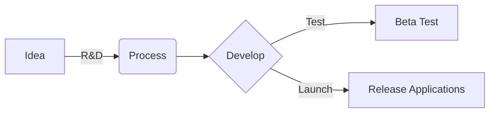

Public | ShowCase

 
# Lotus-Chain Products
Public information, presentation, pitchdeck, ... from LotusChain

#

| Product/Service | What is it | Read more |
|---|---|---|
| **dCDN** | Decentralized CDN  We propose the development and integration of a decentralized Content Delivery Network (dCDN) using the InterPlanetary File System (IPFS). The dCDN aims to revolutionize the traditional CDN model by leveraging the decentralized nature of IPFS to provide a more efficient, secure, and scalable content delivery solution. | [here](https://github.com/blue-lotus-org/lotus-products/tree/main/dCDN) |
| **ALT** | At Live Token  This proposal aims to integrate ALT (At Live Token) into a decentralized application (Dapp) ecosystem. ALT is an ERC721 token that serves as a protocol for creating decentralized identities for users. By integrating ALT into a Dapp, we can leverage its unique features and benefits to enhance user experiences and enable seamless interactions on EVM blockchains.   [notion](https://glass-raven-25b.notion.site/ALT-Eco-System-49d0645ef12c47d6ba4f18bd1165221d?pvs=4) | [here](https://github.com/blue-lotus-org/lotus-products/tree/main/ALT) |
| **ALP** | At Live Token Profile  We propose integrating ALT (At Live Token) into the ALP (ALT Profile) Dapp ecosystem. ALT is an ERC721 token that serves as a protocol for creating decentralized identities for users. By incorporating ALT into ALP, we can leverage its unique features and benefits to enhance user experiences and enable seamless interactions on EVM blockchains.   [notion](https://glass-raven-25b.notion.site/ALT-Eco-System-49d0645ef12c47d6ba4f18bd1165221d?pvs=4) | [here](https://github.com/blue-lotus-org/lotus-products/tree/main/ALP) |
| **IDM** | All EVM Input Data Messages (IDM)  We propose the development and launch of a decentralized application (Dapp) like "Ethereum ALT IDM (Input Data Messages)" on both EVM and Non-EVM blockchains. This Dapp will enable users to send and receive internal messages within the Ethereum Virtual Machine (EVM) where the Dapp is deployed. It will be compatible with all EVM blockchains and will be available on both main net and test net environments. | [here](https://github.com/blue-lotus-org/lotus-products/tree/main/IDM) |
| **Audit** | Smartcontract Audit Service (AI)  We propose integrating a decentralized AI for auditing smart contracts into our Dapp. This AI will provide an automated and efficient way to detect problems and vulnerabilities in smart contracts. The Dapp will not collect any user data, ensuring privacy and security. | [here](https://github.com/blue-lotus-org/lotus-products/tree/main/Audit) |
||||
| **BusinessPlan** | Businessplan and other public documents | [here](https://github.com/blue-lotus-org/lotus-products/tree/main/Business-Doc) |
| **ALT IDM** | Public data about All-EVM ALT IDM | [here](https://github.com/blue-lotus-org/lotus-products/tree/main/Business-Doc/IDM-data) |

#

<!--Proposal of **IDM** via **Polygon** [here](https://jokerace.xyz/contest/polygon/0x15c5cAC608d9cdE3DAE90415bb603536A69bD279/submission/38880587214972381195600122593354249879399730475721321489914785707824309017217)-->

#

### Production Processing 

#

**About Blue Lotus (LotusChain)**:\
Blue Lotus, known in as LotusChain, is at the forefront of blockchain innovation. We specialize in devising and implementing decentralized solutions tailored for both developers and end-users. Our strategic business plan is anchored in the creation and integration of avant-garde products that leverage blockchain technology's full potential.

**Core Focus**:
- Pioneering Decentralized Solutions in Blockchain Technology.
- Bridging the gap between cutting-edge technology and practical applications.

**Our Mission**:\
To empower individuals and organizations by providing blockchain solutions that are not only secure and efficient but also intuitive and user-friendly.

**Our Vision**:\
Aspiring to be the vanguard in the blockchain domain, LotusChain is dedicated to being recognized for our unwavering commitment to security, operational efficiency, and a user-centric approach.

**Innovative Product Suite**:
- Decentralized AI for Smart Contract Auditing: Revolutionizing the way smart contracts are audited with AI-driven decentralization, enhancing security and reliability.
- Decentralized Content Delivery Network (dCDN): A groundbreaking approach to content distribution, optimizing speed and accessibility in a decentralized manner.
- ALT Protocol - Decentralized Identity Management:
  - ALT Identity & ALT Profile: Redefining identity management in the digital realm, focusing on decentralization for enhanced security and user control.
  - ALT IDM - The Future of DeFi: Setting new standards in decentralized finance with robust identity management solutions.
- Lotus Smart Chain (L3 Solution): Our proprietary blockchain solution, offering scalability, security, and efficiency, tailored for the next generation of decentralized applications.

#

> Any investment and participation is accepted.

 <small>  <a href="https://lotuschain.org">LotusChain</a> | <a href="mailto:contact@lotuschain.org">contact us</a> </small>

<!--
# Lotus-Chain Products
Public information, presentation, pitchdeck, ... from LotusChain

#

### dCDN
Decentralized CDN\
We propose the development and integration of a decentralized Content Delivery Network (dCDN) using the InterPlanetary File System (IPFS). The dCDN aims to revolutionize the traditional CDN model by leveraging the decentralized nature of IPFS to provide a more efficient, secure, and scalable content delivery solution.\
[read more](https://github.com/blue-lotus-org/lotus-products/tree/main/dCDN)

### ALT
At Live Token\
This proposal aims to integrate ALT (At Live Token) into a decentralized application (Dapp) ecosystem. ALT is an ERC721 token that serves as a protocol for creating decentralized identities for users. By integrating ALT into a Dapp, we can leverage its unique features and benefits to enhance user experiences and enable seamless interactions on EVM blockchains.\
[read more](https://github.com/blue-lotus-org/lotus-products/tree/main/ALT)

### ALP
At Live Token Profile\
We propose integrating ALT (At Live Token) into the ALP (ALT Profile) Dapp ecosystem. ALT is an ERC721 token that serves as a protocol for creating decentralized identities for users. By incorporating ALT into ALP, we can leverage its unique features and benefits to enhance user experiences and enable seamless interactions on EVM blockchains.\
[read more](https://github.com/blue-lotus-org/lotus-products/tree/main/ALP)

### IDM
All EVM Input Data Messages (IDM)\
We propose the development and launch of a decentralized application (Dapp) like "Ethereum ALT IDM (Input Data Messages)" on both EVM and Non-EVM blockchains. This Dapp will enable users to send and receive internal messages within the Ethereum Virtual Machine (EVM) where the Dapp is deployed. It will be compatible with all EVM blockchains and will be available on both main net and test net environments.\
[read more](https://github.com/blue-lotus-org/lotus-products/tree/main/IDM)

### Audit
Smartcontract Audit Service (AI)\
We propose integrating a decentralized AI for auditing smart contracts into our Dapp. This AI will provide an automated and efficient way to detect problems and vulnerabilities in smart contracts. The Dapp will not collect any user data, ensuring privacy and security.\
[read more](https://github.com/blue-lotus-org/lotus-products/tree/main/Audit)

#

 <small>  <a href="https://lotuschain.org">LotusChain</a> | <a href="mailto:contact@lotuschain.org">contact us</a> </small>

-->
